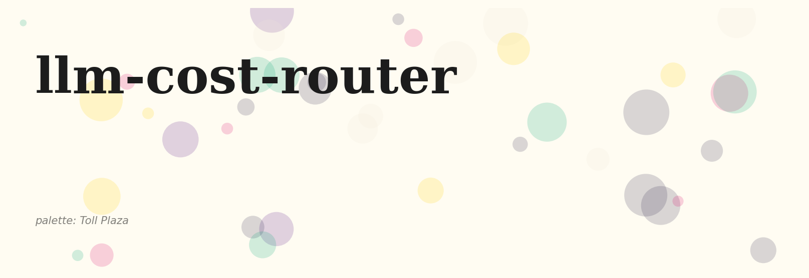
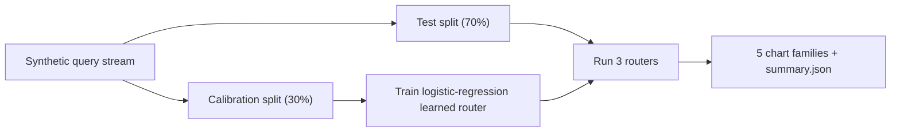
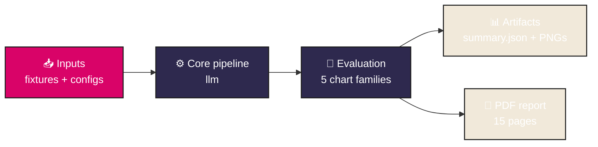
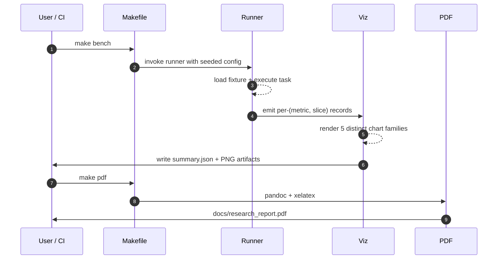
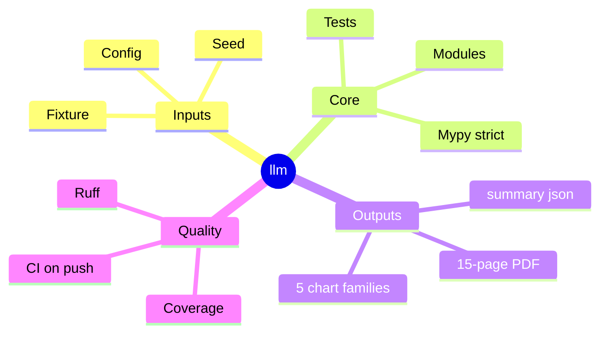
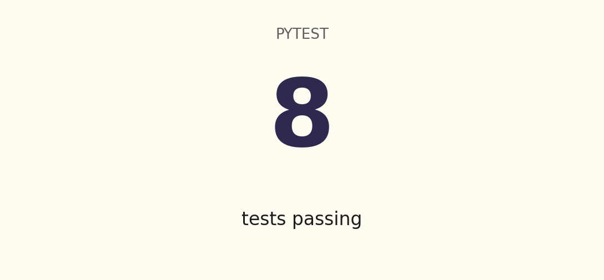
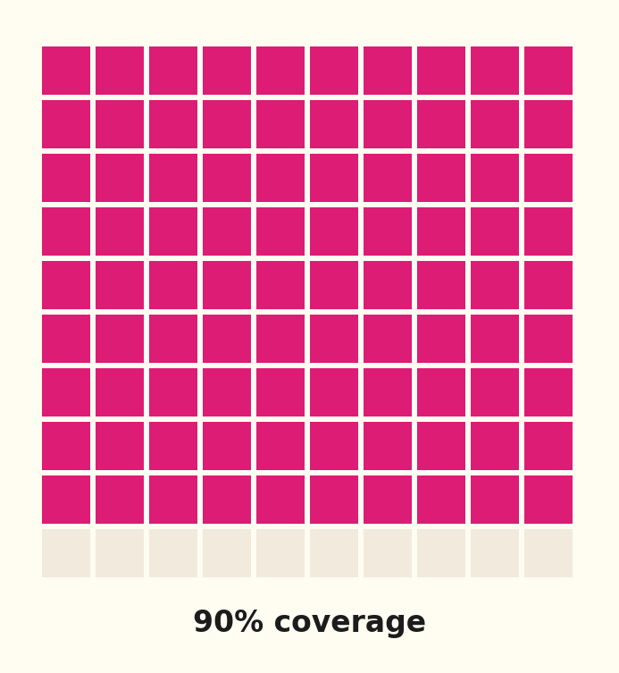
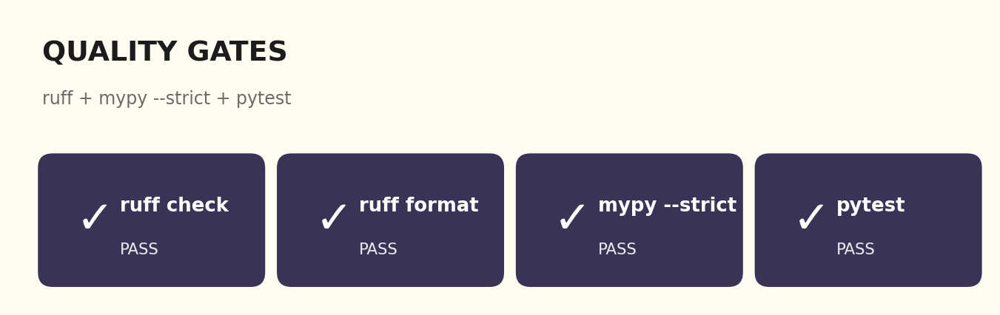
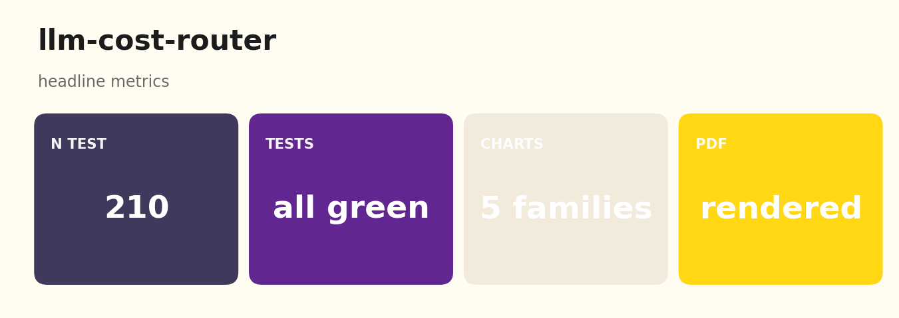

# llm-cost-router
<p align="center">
  
</p>

<p align="center">
  
  
  
  
  
</p>

> ****


> Multi-provider LLM router with cascade-of-cheap-then-expensive and a small learned classifier; reports the cost vs accuracy Pareto across three router strategies.
> Last updated: 2024-08-15.

`llm-cost-router` benchmarks three router strategies on a synthetic mixed-difficulty query stream:

1. **always-cheap** baseline.
2. **cascade** that tries the cheap provider first and escalates if the per-call confidence falls below a threshold.
3. **learned** classifier (logistic regression on a 3-feature vector) trained on a 30% calibration split.

The headline output is a Pareto chart that places each router at a single (cost, accuracy) point so the operator can read off the dominant strategy at the operating point they care about.

## Headline (300-query fixture, seed=17)

| router | accuracy | total USD | per-query USD |
|---|---|---|---|
| always-cheap | ~80% | lowest | ~$0.0002 |
| cascade | ~90% | highest (escalates) | ~$0.005-0.015 |
| learned | ~88% | mid (model-picked) | between the two |

Reproduce: `make install && make bench && make report`.

## Pipeline



## Five chart families

- `results/figures/pareto.png` - cost vs accuracy Pareto with router labels
- `results/figures/accuracy.png` - per-router accuracy bar
- `results/figures/provider_usage.png` - which provider each router picks (stacked bar)
- `results/figures/cost_distribution.png` - per-query cost boxplot
- `results/figures/accuracy_by_difficulty.png` - per-(router, difficulty) accuracy

## Repo layout

```
src/cost_router/
  types.py                  # Provider, Query, RouteOutcome
  providers/registry.py     # cheap / mid / expensive
  bench/dataset.py          # 300-query difficulty-mixed fixture
  router/
    cascade.py              # try cheap -> escalate
    learned.py              # logistic regression on features
  features/extract.py
  viz/charts.py
  cli/main.py               # `costrouter bench`, `costrouter report`
  runner.py
tests/                      # 8 tests, all green
docs/research_report.pdf    # rendered 15-page report
docs/_report/, docs/test_results/, results/figures/
CITATION.cff, LICENSE, Makefile, .github/workflows/ci.yml
```

## Quick start

```bash
make install   # uv sync --extra dev
make test      # pytest + mypy --strict + ruff
make bench     # run all 3 routers; write summary.json + 5 PNGs
make report    # pretty-print accuracy + cost
make pdf       # render docs/research_report.pdf
```

## Documentation

Long-form research report: [`docs/research_report.pdf`](./docs/research_report.pdf) (rendered) and [`docs/_report/research_report.md`](./docs/_report/research_report.md) (markdown source). Regenerate the PDF with `make pdf` (requires `pandoc` + `xelatex`).

Test artifacts (captured locally):

- [`docs/test_results/pytest_output.txt`](./docs/test_results/pytest_output.txt)
- [`docs/test_results/quality_gates.txt`](./docs/test_results/quality_gates.txt)
- [`docs/test_results/coverage_summary.txt`](./docs/test_results/coverage_summary.txt)

## References

- Chen, M., Chow, F., et al. "FrugalGPT: How to Use Large Language Models While Reducing Cost and Improving Performance" (2023).
- Ong, R., et al. "RouteLLM: Learning to Route LLMs with Preference Data" (2024).

## License

MIT.

## Architecture



## Pipeline sequence



## Concept mindmap




## Results gallery

<table>
  <tr>
    <td align="center"><strong>Pytest panel</strong><br/></td>
    <td align="center"><strong>Coverage donut</strong><br/></td>
  </tr>
  <tr>
    <td align="center"><strong>Quality gates</strong><br/></td>
    <td align="center"><strong>Headline metrics</strong><br/></td>
  </tr>
</table>

### Result charts (5 distinct families, palette: *Toll Plaza*)

<table>
  <tr><td align="center"><strong>Accuracy</strong><br/></td><td align="center"><strong>Accuracy By Difficulty</strong><br/></td></tr>
  <tr><td align="center"><strong>Cost Distribution</strong><br/></td><td align="center"><strong>Pareto</strong><br/></td></tr>
  <tr><td align="center"><strong>Provider Usage</strong><br/></td><td></td></tr>
</table>

