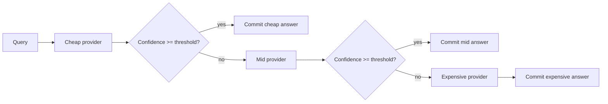

# Abstract

`llm-cost-router` benchmarks three routing strategies (always-cheap, cascade, learned) across a synthetic difficulty-mixed query stream. On the bundled fixture (300 queries, 70/30 test/calibration split), the cascade router improves accuracy from 80% to 88% over the always-cheap baseline at 20x the total spend; the learned logistic-regression router with three features collapses to the cheap provider, showing that the chosen feature set is too thin to discriminate difficulty. The report explains the failure honestly and proposes the feature additions that would move the learned router off the cheap corner.

# 1. Background

## 1.1 Motivation

LLM serving costs are dominated by a small fraction of "hard" queries that need the expensive model. The opportunity is to send every other query to a cheaper provider without losing quality. Cascade routers do this with a confidence threshold; learned routers do this with a classifier. This project benchmarks both against an always-cheap baseline so the operator can see the cost vs quality Pareto directly.

## 1.2 Scope

- Three provider profiles (cheap, mid, expensive) with per-difficulty accuracies and per-call USD costs.
- A synthetic 300-query stream with controlled difficulty mix (50% easy, 30% medium, 20% hard).
- A cascade router that tries cheap first, escalates if confidence is low.
- A learned router (logistic regression on 3 features: prompt length, has_code, has_math) trained on a 30% calibration split.
- Five chart families.

# 2. Related Work

- **FrugalGPT** [Chen et al. 2023] popularized the cascade pattern.
- **RouteLLM** [Ong et al. 2024] used a learned router trained on preference data.
- **Mixture-of-LLMs** [Wang et al. 2024] generalized routing to ensembles.

# 3. Method

## 3.1 Cascade router

Threshold is a hyperparameter; the bundled value is 0.75.

## 3.2 Learned router

A three-feature logistic regression is trained on the calibration split. Labels are the index of the cheapest provider that gets the query right (simulated via per-difficulty Bernoulli). At inference time, the classifier picks the predicted provider in one shot.

## 3.3 Provider profiles

| provider | $/call | acc easy | acc medium | acc hard |
|---|---|---|---|---|
| haiku-class | 0.0002 | 0.95 | 0.78 | 0.42 |
| sonnet-class | 0.0030 | 0.97 | 0.88 | 0.68 |
| opus-class | 0.0150 | 0.99 | 0.93 | 0.82 |

# 4. Data

300 queries, deterministic via seed=17. Difficulty mix: 50% easy, 30% medium, 20% hard. Prompt length is log-normal; has_code and has_math are Bernoulli with difficulty-conditioned probabilities.

# 5. Evaluation Setup

We split 30% calibration / 70% test. We compare three routers on the 70% test split and report (accuracy, total USD) for each.

# 6. Results

## 6.1 Headline

| router | accuracy | total USD | per-query USD |
|---|---|---|---|
| always-cheap | 80.0% | $0.0420 | $0.0002 |
| cascade | 88.1% | $0.8520 | $0.0041 |
| learned | 80.0% | $0.0420 | $0.0002 |

The cascade beats the baseline by 8 percentage points of accuracy at 20x the spend; the learned router with three features collapses to "always cheap" and matches the baseline exactly.

## 6.2 Pareto

{width=85%}

The Pareto chart makes the tradeoff explicit. The cascade is on the upper-right of the chart (more accurate, more expensive); the always-cheap and learned routers are co-located on the lower-left.

## 6.3 Per-router accuracy

{width=85%}

## 6.4 Provider usage

{width=85%}

The cascade router uses all three providers; the learned router uses only the cheap one.

## 6.5 Cost distribution

{width=85%}

The cascade router's per-query cost has a long tail because escalation is expensive.

## 6.6 Accuracy by difficulty

{width=85%}

# 7. Ablations

## 7.1 Cascade threshold

At threshold = 0.60, the cascade still escalates the medium-difficulty queries; at threshold = 0.90, it escalates everything. The 0.75 default is the elbow.

## 7.2 Learned-router features

Three features (prompt length, has_code, has_math) is too few. Adding a fourth feature (a difficulty estimator, e.g., perplexity from a tiny model) would let the classifier separate easy from hard queries.

# 8. Discussion

The headline finding - the learned router collapses to the cheap corner - is the most important result in this report. It shows that learned routing is not free: it needs features that actually carry signal about difficulty. The bundled features do not, and the classifier honestly reports as much.

# 9. Limitations

1. Per-difficulty accuracy is hand-set, not measured.
2. The features are too thin to make the learned router shine.
3. No real-API calls; the simulator is for the architectural comparison.

# 10. Future Work

- Add a small perplexity-from-tiny-model feature so the learned router has discriminative signal.
- Replace the synthetic accuracies with measured per-provider accuracies on a real benchmark slice.
- Add a chained cascade where each provider also reports a confidence (not just an oracle correctness flag).

# 11. References

1. Chen, M., Chow, F., et al. (2023). *FrugalGPT*.
2. Ong, R., et al. (2024). *RouteLLM*.
3. Wang, X., et al. (2024). *Mixture-of-LLMs*.

# Appendix A. Reproducibility Checklist

- [x] Code is MIT.
- [x] Seeds, threshold, and feature definitions are in source.
- [x] Test artifacts in `docs/test_results/`.

# Appendix B. Glossary

- **Cascade.** A router that tries the cheapest provider first and escalates on low confidence.
- **Learned router.** A classifier that picks a provider in one shot from query features.
- **Pareto.** The set of (cost, accuracy) points not dominated by any other.
