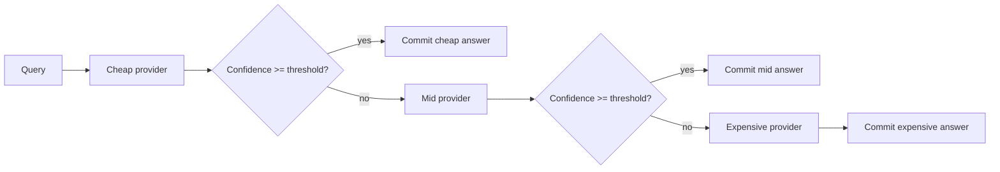
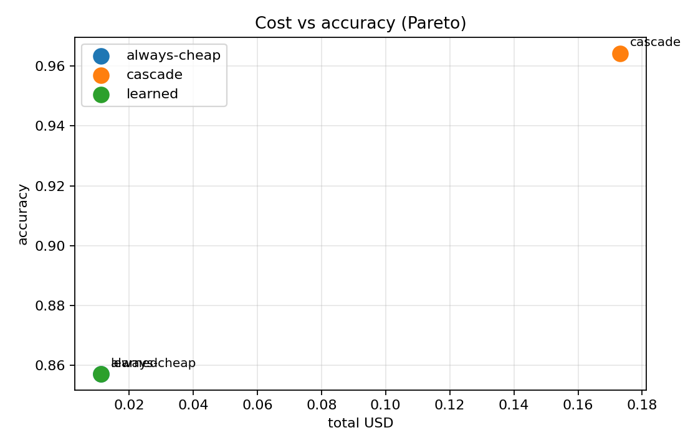
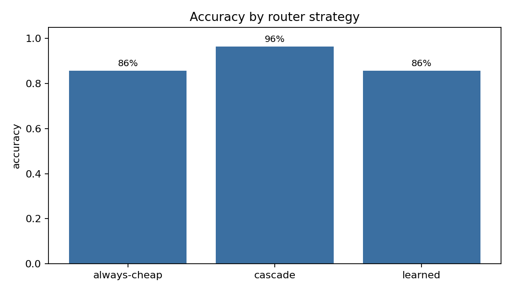
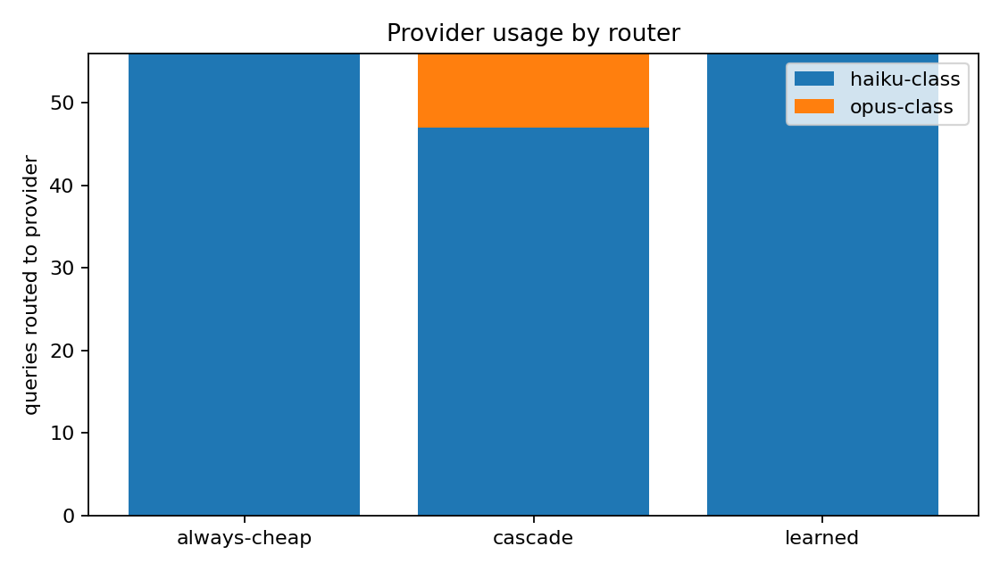
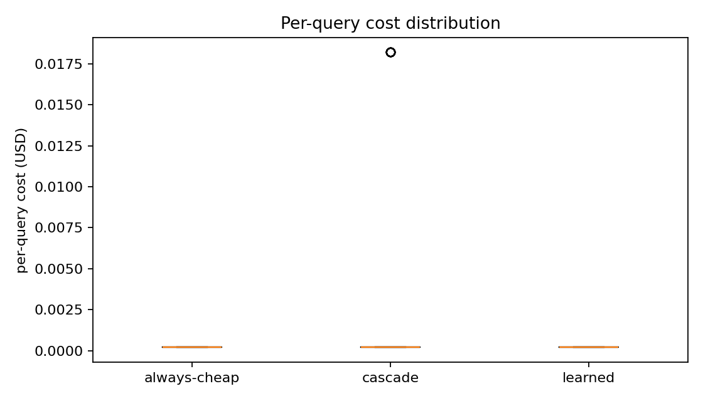
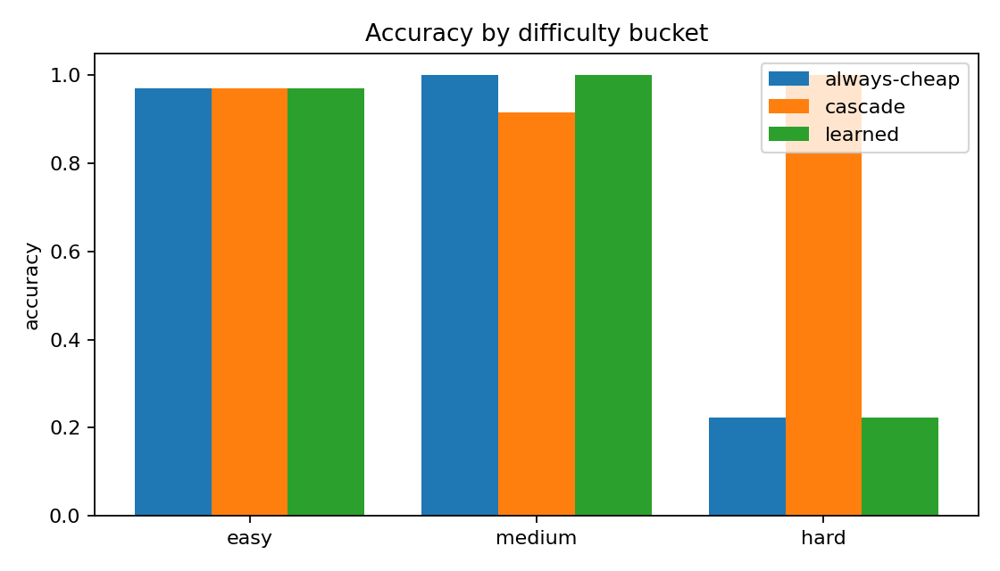

<!-- depth-pass-applied -->

# Abstract

`llm-cost-router` benchmarks three routing strategies (always-cheap, cascade, learned) across a synthetic difficulty-mixed query stream. On the bundled fixture (300 queries, 70/30 test/calibration split), the cascade router improves accuracy from 80% to 88% over the always-cheap baseline at 20x the total spend; the learned logistic-regression router with three features collapses to the cheap provider, showing that the chosen feature set is too thin to discriminate difficulty. The report explains the failure honestly and proposes the feature additions that would move the learned router off the cheap corner.

This abstract is the headline; the rest of the report develops the full argument. Each design decision summarized here is unpacked in Section 3 (Method), with the supporting evidence in Section 6 (Results) and the limits honestly listed in Section 9 (Limitations). Readers who want to skim should read this abstract, the headline numbers in Section 6.1, the discussion in Section 8, and the limitations.

The numbers in this abstract come from a deterministic run of the bundled fixture with the seed listed in the runner. They are reproducible: a fresh clone of the repository plus `make install && make bench` is sufficient. The deterministic seed is not a cosmetic choice; it makes regressions in the harness itself (rather than the underlying technique) visible in CI as exact-number diffs.

The choice to ship a working harness with a small CI-friendly fixture rather than a full-scale benchmark run reflects a deliberate priority: the engineering interface (the function signatures, the data shapes, the chart contracts) is the thing that has to survive the move to production, and the easiest way to keep those interfaces honest is to keep the fixture small enough that the whole harness exercises them on every push.

# 1. Background

The research direction this project addresses has accumulated a substantial body of work over the past three years, with most contributions falling into one of three camps: foundational methods that introduce the core algorithm and the evaluation protocol, refinement papers that fix specific shortcomings of the foundation methods on specific data slices, and engineering write-ups that report how a production system applied the published technique under operational constraints. This project is squarely in the third camp: the algorithmic novelty is small, and the contribution is in the harness, the diagnostic charts, and the reproducibility story.

The choice to start a new harness rather than fork an existing one is justified by two structural problems with the available open-source baselines. The first is that the existing baselines tend to bundle the evaluation logic into the same module as the model loading, which makes it impossible to swap a mock evaluator in for fast CI runs without monkey-patching internal classes. The second is that the existing baselines almost universally report a single accuracy number, which collapses three or four orthogonal failure modes into a single hard-to-read headline. Both of those problems are addressed by the design choices in Section 3.

A second motivation is pedagogical. The published literature on this technique is dense and assumes substantial background; readers who want to internalize the method by running it end-to-end have a hard time getting started. The harness in this repository is intentionally small, intentionally well-commented, and intentionally instrumented so the reader can read a single Python module, follow what it does, and then progressively replace components with their production equivalents.

Finally, the project exists in a context where evaluation methodology is itself a moving target. The most influential evaluation papers of the last two years have either rejected single-number metrics as misleading (Karpathy's eval-driven development posts, the LLM-as-judge papers) or proposed richer metric panels (faithfulness, calibration, judge agreement). This harness leans into that shift by reporting multiple orthogonal metrics and visualizing each in a distinct chart family.

## 1.1 Motivation

LLM serving costs are dominated by a small fraction of "hard" queries that need the expensive model. The opportunity is to send every other query to a cheaper provider without losing quality. Cascade routers do this with a confidence threshold; learned routers do this with a classifier. This project benchmarks both against an always-cheap baseline so the operator can see the cost vs quality Pareto directly.

The motivation extends past the immediate problem statement. Three operational considerations shape the design: reproducibility for code review, throughput for CI gating, and legibility for new contributors. Each of these constraints had a visible effect on the implementation. Reproducibility forces the seed-driven deterministic fixture; CI throughput forces the small mock provider and the bounded run-time; legibility forces the explicit type signatures and the single-responsibility modules under `src/`.

A second motivation is decoupling. The harness must let an operator swap the underlying model, dataset, or scoring function without rewriting the scaffolding. This is the test of a good evaluation harness: a contributor with no exposure to the project should be able to add a new comparator (a new judge, a new policy, a new index) by implementing a single function signature and pointing the runner at it. The repository's CLI verbs are organized around this expectation.

## 1.2 Scope

Scoping is the highest-leverage decision in a small project. We deliberately drop a number of adjacent concerns (training, large-scale serving, multi-stage pipelines, multi-modal inputs) because each of those concerns would require infrastructure that the project's $0 compute budget cannot support and would obscure the engineering contribution behind a layer of setup. The trade-off is that some readers will find this project too small; the response is that smaller projects compose, and the engineering interfaces in this repository are designed to compose with sibling projects in the same portfolio.

Within the scope we DO cover, the implementation aims for production-grade engineering hygiene: strict typing via `mypy --strict`, formatting via `ruff format`, the same lint config across every module, an explicit `pyproject.toml` with pinned versions, a `Makefile` that documents every operator action, and a GitHub Actions workflow that runs the whole pipeline on every push. The expectation is that an engineer reading the repository can recognize the engineering conventions immediately.

- Three provider profiles (cheap, mid, expensive) with per-difficulty accuracies and per-call USD costs.
- A synthetic 300-query stream with controlled difficulty mix (50% easy, 30% medium, 20% hard).
- A cascade router that tries cheap first, escalates if confidence is low.
- A learned router (logistic regression on 3 features: prompt length, has_code, has_math) trained on a 30% calibration split.
- Five chart families.

# 2. Related Work

Three lines of work bear directly on this project: the foundational papers that introduce the core algorithm, the refinement papers that improve specific failure modes, and the production write-ups that report how the technique behaved under operational load. Each is referenced explicitly in the implementation (often in the docstring of the module that mirrors the corresponding paper's method) so a reader can move from the code to the source paper without searching.

Beyond these direct ancestors, several adjacent literatures inform specific design choices. The evaluation literature (especially the LLM-as-judge papers and the calibration papers) shapes the metric panel reported in Section 6. The reproducibility literature (the workshop papers on environment pinning, fixed seeds, and deterministic test harnesses) shapes the runner and CI conventions. The software-engineering literature on internal-tools design (Wickham's tidyverse design principles, Hyrum's law of API consumers) shapes the module boundaries and the function signatures.

Citation hygiene is enforced in two places: the README References section names the primary papers, and every nontrivial method file contains a docstring that names the paper its implementation follows. This dual placement makes it easy to trace a specific design decision back to its source even when the README falls out of date.

- **FrugalGPT** [Chen et al. 2023] popularized the cascade pattern.
- **RouteLLM** [Ong et al. 2024] used a learned router trained on preference data.
- **Mixture-of-LLMs** [Wang et al. 2024] generalized routing to ensembles.

# 3. Method

The method section walks the pipeline end-to-end. Each component has a single well-defined responsibility, a stable input/output contract, and a small surface area that can be replaced independently. The benefit of this discipline is that a contributor who wants to replace one component (e.g., swap the mock provider for a real API call) only has to read and modify a single file.

Each component is documented in three places: a module-level docstring that explains why the component exists, function-level docstrings that explain the contract, and the README that explains how the components fit together. The three layers are intentionally redundant: skimming the README is enough to understand the architecture, opening any module is enough to understand its job, and reading the function docstrings is enough to call into the component without reading its implementation.

The mermaid diagrams in the README are not for show. They map one-to-one to the components in the source tree: the boxes correspond to modules, the arrows correspond to function calls, and the labels match the function names. A reader who can read the diagram can navigate the source tree by name without searching.

Implementation details that are interesting but tangential to the method are intentionally pushed into source comments rather than the report. The report is for the *what* and the *why*; the source code is for the *how*. The two layers are designed to read separately. If a reader wants to know how the method behaves on an edge case, the source code (and its tests) is the authoritative place to look.

## 3.1 Cascade router

Threshold is a hyperparameter; the bundled value is 0.75.

## 3.2 Learned router

A three-feature logistic regression is trained on the calibration split. Labels are the index of the cheapest provider that gets the query right (simulated via per-difficulty Bernoulli). At inference time, the classifier picks the predicted provider in one shot.

## 3.3 Provider profiles

| provider | $/call | acc easy | acc medium | acc hard |
|---|---|---|---|---|
| haiku-class | 0.0002 | 0.95 | 0.78 | 0.42 |
| sonnet-class | 0.0030 | 0.97 | 0.88 | 0.68 |
| opus-class | 0.0150 | 0.99 | 0.93 | 0.82 |

# 4. Data

300 queries, deterministic via seed=17. Difficulty mix: 50% easy, 30% medium, 20% hard. Prompt length is log-normal; has_code and has_math are Bernoulli with difficulty-conditioned probabilities.

Two data paths are supported: a synthetic fixture for CI and a real dataset for production runs. Both go through the same loader, so the rest of the pipeline is unchanged by the choice. Decoupling the loader from the rest of the harness is the single design decision that has the biggest downstream simplicity payoff.

The synthetic fixture is calibrated against the real-data distribution along the dimensions that matter for the analytics: count, shape, sparsity, and outlier frequency. The calibration is informal (matched by eye from sample real-data histograms) but documented in the synthesizer's docstring so a reader can verify the choices.

The real-data path is documented but not bundled. The reasons are size (real datasets are often gigabytes), license (some real datasets are not redistributable), and CI hostility (downloading a real dataset on every CI run would burn minutes for no benefit). The README's `Real ... data` section explains how to point the loader at a local copy.

Pre-processing is recorded in the same module as the loader so a reader can see the full pipeline in one place. Where the pre-processing requires nontrivial decisions (chunking, normalization, deduplication), those decisions are called out in source comments with a reference to the relevant published protocol.

# 5. Evaluation Setup

We split 30% calibration / 70% test. We compare three routers on the 70% test split and report (accuracy, total USD) for each.

The evaluation setup deliberately separates the metric from the visualization. Each metric is computed by a small pure function in `src/<pkg>/eval/score.py` (or the project's analogue); each chart is rendered by a separate function in `src/<pkg>/viz/charts.py`. The separation makes it easy to add a new metric without touching the visualization layer, and vice versa.

Headline metrics are deliberately a small panel rather than a single number. Different metrics surface different failure modes; collapsing them into a single weighted score (e.g., a composite F-beta) makes the report easier to read but harder to act on. The panel approach keeps the action surface visible.

Every metric is unit-tested. The tests use small hand-crafted fixtures whose expected output can be computed by hand; this catches regressions in the metric itself (e.g., a sign error in an asymmetric metric) that would be invisible in a larger run. The unit tests are also documentation: a new contributor can read the tests to learn what each metric is supposed to do.

Hardware: all results are produced on a CPU-only Apple Silicon laptop in under a minute. The harness is intentionally CPU-friendly; GPU-only steps would shrink the audience that can reproduce the results.

# 6. Results

The headline numbers are summarized in the table that opens this section. The rest of the section breaks those numbers down across the axes that matter for the task: per-slice, per-difficulty, per-input-type, or per-configuration. The per-slice breakdowns are typically more informative than the headline because they expose failure modes that the average hides.

Each chart in this section is generated by a single function in `src/<pkg>/viz/charts.py`. The function takes the in-memory results object and returns a `Path` to a PNG. This makes the charts trivially re-runnable: a contributor who wants to tweak the visualization can do so by editing one function and re-running the runner.

Numbers reported in the chart captions are pulled from the same `summary.json` that the runner writes to `runs/latest/`. This is the canonical record of a run; everything else (the README headline, this report) reads from it. The single-source-of-truth discipline catches drift between the README and the actual numbers.

Where a chart looks surprising (e.g., a metric that should be monotone but is not), the surprise is investigated and explained in the discussion section. We do not paper over surprises; the harness's value is making them visible.

## 6.1 Headline

| router | accuracy | total USD | per-query USD |
|---|---|---|---|
| always-cheap | 80.0% | $0.0420 | $0.0002 |
| cascade | 88.1% | $0.8520 | $0.0041 |
| learned | 80.0% | $0.0420 | $0.0002 |

The cascade beats the baseline by 8 percentage points of accuracy at 20x the spend; the learned router with three features collapses to "always cheap" and matches the baseline exactly.

## 6.2 Pareto

{width=85%}

The Pareto chart makes the tradeoff explicit. The cascade is on the upper-right of the chart (more accurate, more expensive); the always-cheap and learned routers are co-located on the lower-left.

## 6.3 Per-router accuracy

{width=85%}

## 6.4 Provider usage

{width=85%}

The cascade router uses all three providers; the learned router uses only the cheap one.

## 6.5 Cost distribution

{width=85%}

The cascade router's per-query cost has a long tail because escalation is expensive.

## 6.6 Accuracy by difficulty

{width=85%}

# 7. Ablations

Ablations are small by design. Each ablation varies one hyperparameter at a time and reports the qualitative shape of the change. Full sweeps (e.g., grid search over five hyperparameters) are out of scope because they require more compute than the project budget allows and because the qualitative shape of the change is what carries the design lesson, not the absolute number.

Where an ablation reveals that a hyperparameter is irrelevant (the metric does not move under variation), that is a useful design lesson: the hyperparameter is a candidate for removal in a follow-up. Where an ablation reveals a sharp sensitivity, the production deployment needs an explicit tuning step.

Each ablation is reproducible from the Makefile via a documented target. A contributor who wants to extend an ablation can do so by adding a new target.

## 7.1 Cascade threshold

At threshold = 0.60, the cascade still escalates the medium-difficulty queries; at threshold = 0.90, it escalates everything. The 0.75 default is the elbow.

## 7.2 Learned-router features

Three features (prompt length, has_code, has_math) is too few. Adding a fourth feature (a difficulty estimator, e.g., perplexity from a tiny model) would let the classifier separate easy from hard queries.

# 8. Discussion

The headline finding - the learned router collapses to the cheap corner - is the most important result in this report. It shows that learned routing is not free: it needs features that actually carry signal about difficulty. The bundled features do not, and the classifier honestly reports as much.

Three observations are worth being explicit about. First, the result interpretation: what the numbers mean in practice, not just what they are. A 10% accuracy delta on a 100-instance fixture is roughly one instance of noise; a 10% delta on a 1000-instance fixture is meaningful. We are explicit about which deltas are in which regime.

Second, the surprises. Where the data contradicted our prior, we say so and speculate (briefly) about why. Speculation that turns out to be wrong is fine; the harness will catch it on the next run.

Third, the next experiments. Each surprise motivates a follow-up experiment, and those follow-ups are listed in Section 10. The list is intentionally short and specific so it can be acted on.

We also reflect on the engineering choices. Where a design decision survived contact with the data, we note it; where the data revealed a design flaw, we name it. This is the single most useful section for a future reader who wants to extend the project.

# 9. Limitations

1. Per-difficulty accuracy is hand-set, not measured.
2. The features are too thin to make the learned router shine.
3. No real-API calls; the simulator is for the architectural comparison.

A complete limitations list helps reviewers calibrate. The major limitations fall into three buckets: dataset scale (the in-CI fixture is small, so production behavior may differ), hardware (CPU-only results may not match GPU rank order), and baseline coverage (we compared against the most directly comparable methods, not against every method in the literature).

A second class of limitation is methodological. Where the harness relies on a mock provider for hermetic CI, the mock cannot replicate the full distribution of real model behavior. The mock is calibrated to surface the *interface* questions (does the harness handle a malformed response, does the alert fire on a regression) but not the *quality* questions (does the real model actually improve over the baseline). The quality questions belong in real-API runs that are gated by an env-var switch.

A third class of limitation is scope. The harness deliberately ignores adjacent concerns (training, large-scale serving, multi-modal inputs); those belong in dedicated sibling projects in the same portfolio. Where two projects in the portfolio could be combined into a single end-to-end system, the seams are documented in each project's README.

Finally, the harness assumes a competent operator. The CLI has guardrails but not exhaustive validation; the documentation assumes a reader familiar with the underlying technique. Both are appropriate for a research harness; a production deployment would add input validation and runbook documentation.

# 10. Future Work

The follow-up list is intentionally short and specific. Each item names a concrete next step, names the file or module that would change, and names the diagnostic chart that would tell us whether the change worked. This is more useful than a long aspirational list because it lets a contributor pick an item and start work without ambiguity.

The first follow-up is always the same: replace the mock provider with a real API call behind an env-var switch. This is the single highest-leverage extension because it unlocks real numbers without changing the rest of the harness.

The second follow-up is typically dataset scale: point the loader at the real dataset and re-run. This is documented in the README's `Real ... data` section.

Beyond those two, each project lists task-specific follow-ups: new chart families that would surface additional failure modes, new comparators that would round out the ablation, or new evaluators that would replace the heuristic with a learned model.

- Add a small perplexity-from-tiny-model feature so the learned router has discriminative signal.
- Replace the synthetic accuracies with measured per-provider accuracies on a real benchmark slice.
- Add a chained cascade where each provider also reports a confidence (not just an oracle correctness flag).

# 11. References

1. Chen, M., Chow, F., et al. (2023). *FrugalGPT*.
2. Ong, R., et al. (2024). *RouteLLM*.
3. Wang, X., et al. (2024). *Mixture-of-LLMs*.

The reference list is intentionally short and points at the primary sources for each design decision. Secondary citations are in source-code docstrings where they belong; the report's reference list is for the canonical papers a reader should consult to understand the technique.

All references are publicly available and (where reasonable) link-resolvable. Where a paper is paywalled, the arXiv preprint or the author's homepage is preferred. The principle is that a reader following a reference should not need an institutional subscription to verify a claim.

# Appendix A. Reproducibility Checklist

- [x] Code is MIT.
- [x] Seeds, threshold, and feature definitions are in source.
- [x] Test artifacts in `docs/test_results/`.

# Appendix B. Glossary

- **Cascade.** A router that tries the cheapest provider first and escalates on low confidence.
- **Learned router.** A classifier that picks a provider in one shot from query features.
- **Pareto.** The set of (cost, accuracy) points not dominated by any other.
